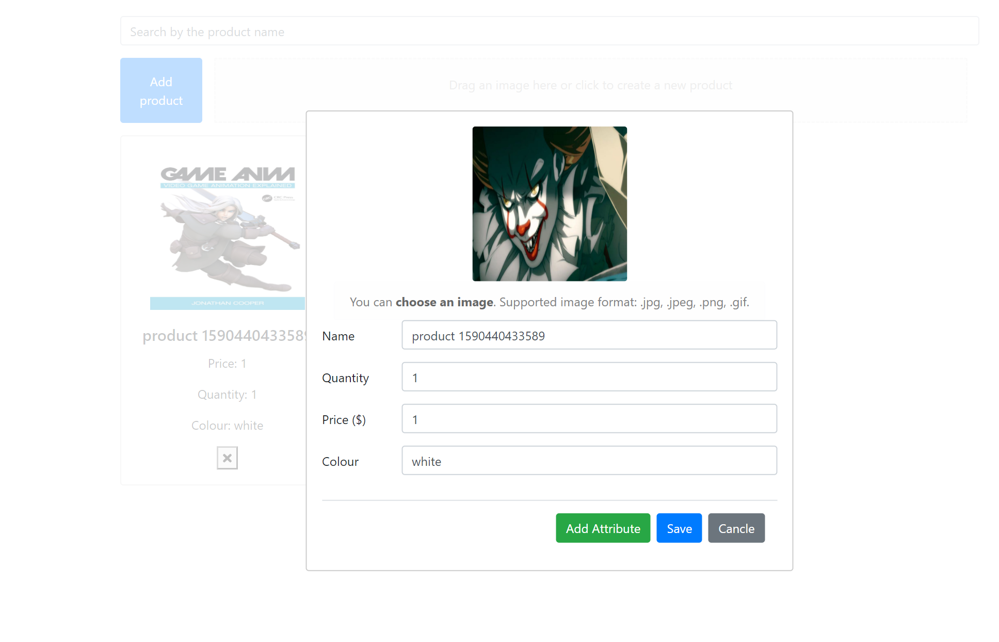
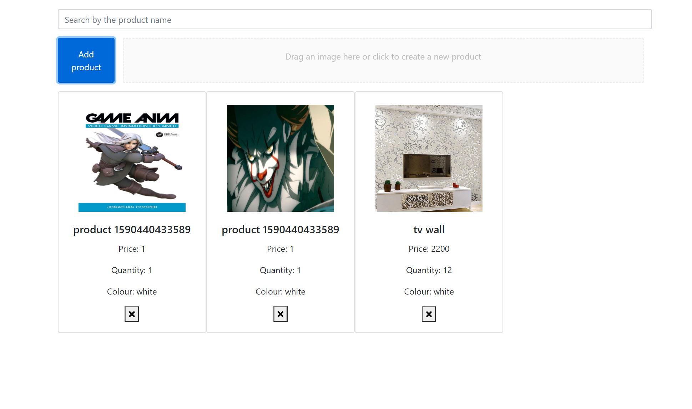

# About
This app allows user to add products to the catalog by submiting a form or by drag and drop, to delete and to search for a product in the catalog.
The products details are stored in MongoDB (local or remote) and the products images are stored in a AWS S3 bucket which you can configure the project to use your own bucket.
## Tech stack
React, AWS, MongoDB

## Installation
__Start the Server__

- in `/server/config`, create a json file `awsConfig.json` and write in this file as follows:\
```
{
    "accessKeyId": "YOUR AWS ACESS KEY ID",
    "secretAccessKey": "YOUR AWS SECRETACCESS KEY",
    "bucket": "YOUR BUCKET NAME"
}
```
Please note that if you use your own aws bucket you will need to allow public `put` and `read` to your S3 bucket.
- Open terminal in the `/server` folder, make sure port `5000` in your localhost is available, then install the dependencies by `npm install`;
- Start the local server `npm start`.

__Start the client__
- Open another terminal in the `/web` folder, make sure port `8080` in your localhost is available, then install the dependencies by `npm install`;
- Start the local server `npm run dev`.

You should see the index page prompt in your default browser, if not, visit `localhost:8080` to see the app.

## Preview


